# Start screen

- BetterNotes now handles saving data automatically!
- To use the automatic saving system, either import your .bn file (by pressing import and selecting it using your operating system's file window) or by creating it (by pressing create and selecting where you want it to be saved using your operating system's file window).
  - Now anytime you make any change (e.g. edit a note, move a directory, rename a directory...) the changes will be immediately written to your .bn file.
- Of course you are free to forgo saving your data entirely by pressing don't save.
  - Do note that you are still able to manually export your data using the legacy saving system in the settings menu which is detailed below.

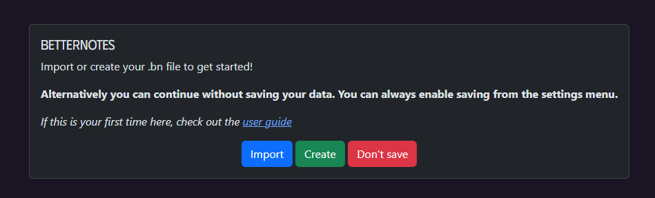

# Settings

To start with you should probably configure your settings. Do so by clicking on the BetterNotes logo in the top left
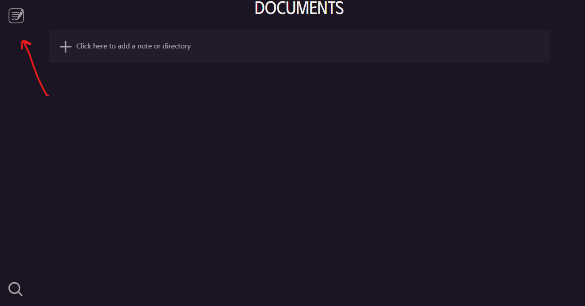
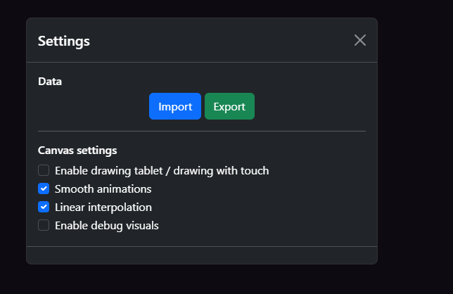

## Data

- This is where you can manually import and export your data. Please note that this can now be done automatically, by either creating or uploading your \*.bn file when you start the application, as detailed previously.
- Pressing export, downloads a \*.bn file, which contains all of your notes and directories encoded in JSON.
  - Make sure to do this before closing the application
- Pressing import opens a OS specific window asking for you to upload your .bn file
  - Once you upload it, all of your notes and directories will be available, as they were before, in the app

## Canvas

- You can modify settings for the canvas as you see fit
- Please enable any which are relevant
  - The main one to watch out for is `Enable drawing tablet / drawing with touch` in the case you are using a drawing tablet or using drawing with touch and not a stylus

# Document interface

When you open up BetterNotes, you are greeted with the document interface
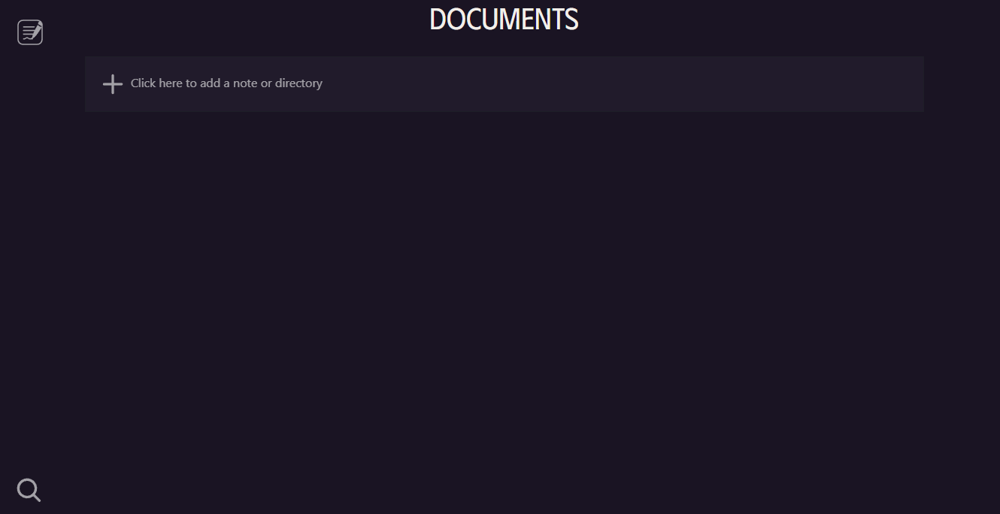
From here you can access the settings menu, as discussed previously, create a new note / directory or search for notes.

## Creating notes and directories

### Creating a note

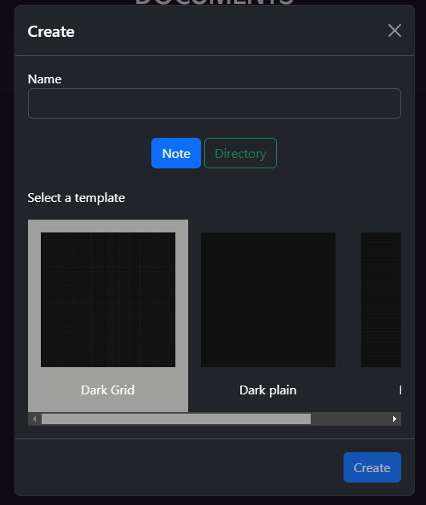

- When creating a note you can choose a name and a template
- A template is automatically selected but a name won't be
- The "create" button will stay disabled until a valid name is selected
  - A note's name can't be empty and it can't have the same name as any other notes or directories you have created
  - The name's are not case sensitive
- Upon pressing the "create" button, the note you just created will be opened in the editor
- The note will be created in the directory in which you placed the "Add" button in

### Create a directory

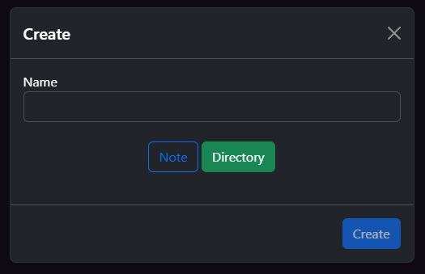
Clicking the toggle on the previous menu allows you to create a directory.

- You only need to enter a name
  - A directory's name can't be empty and it can't have the same name as any other notes or directories you have created
  - The "create" button will stay disabled until these conditions are satisfied
- Once again the directory is created in the directory in which you clicked the "Add" button in

## Navigating the file system

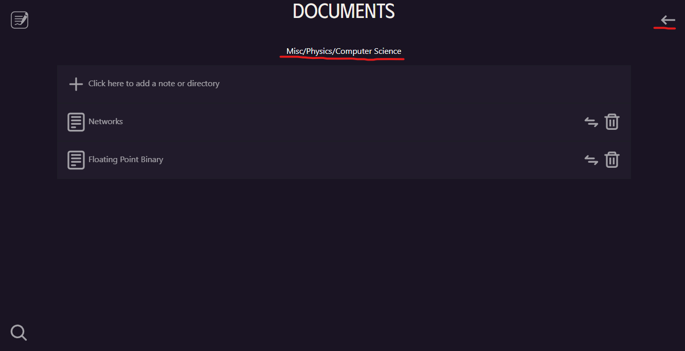

- The path of the current directory can be seen at below the "Documents" text
- To move up a level/directory through the file system, press the back arrow in the top right corner

## Deleting notes or directories

Deleting notes or directories can be done by clicking the bin icon next to them
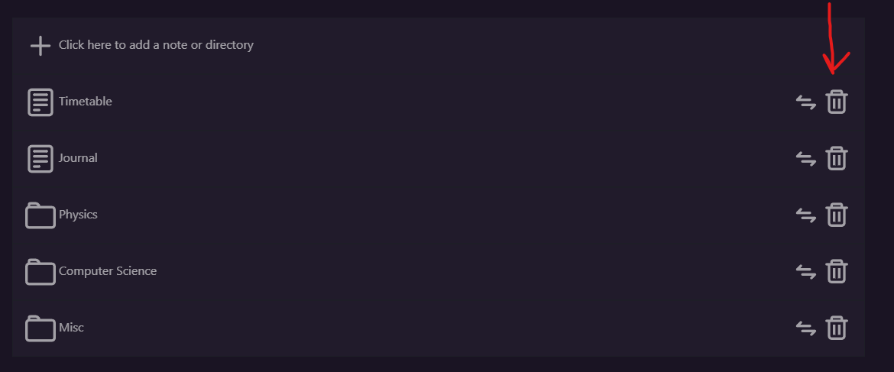

**_Be careful when doing this_** because there is **_no confirmation_** .

## Moving notes or directories

Moving notes or directories can be done by clicking the "move" icon next to them
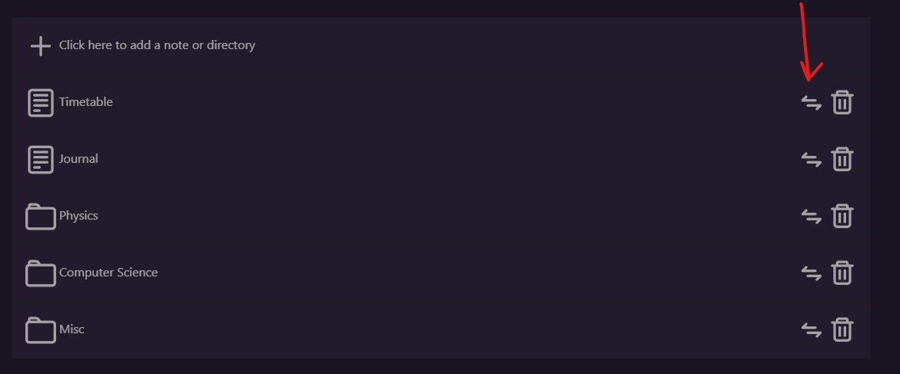
Doing so brings up a menu like this.
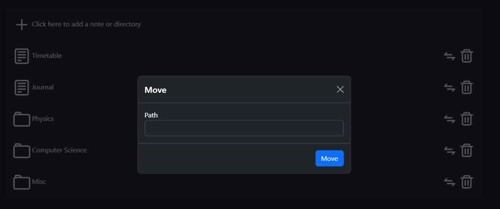

- The move button is only enabled when a valid path is input.
- An empty path is a valid path. This means to move the item (note/directory) to the root of the file system
- Paths are not case sensitive
- **For example**: If you wanted to move "Timetable" into "Misc", the path you would input is `Misc/`
  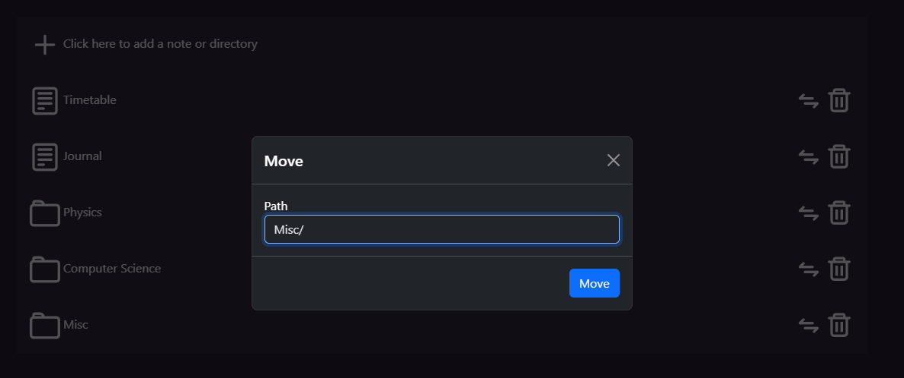
- **Another example**: if you wanted to move "Physics" inside of "Misc" and then "Computer Science" inside of "Physics"
  - You would move "Physics" to the path `Misc`
  - You would move "Computer Science" to `Misc/Physics`\*\*
- Invalid actions
  - You can't move notes or directories into notes
  - You path must be a valid path

## Searching for notes

- You can search for notes by clicking on the search icon in the bottom left corner of the screen
  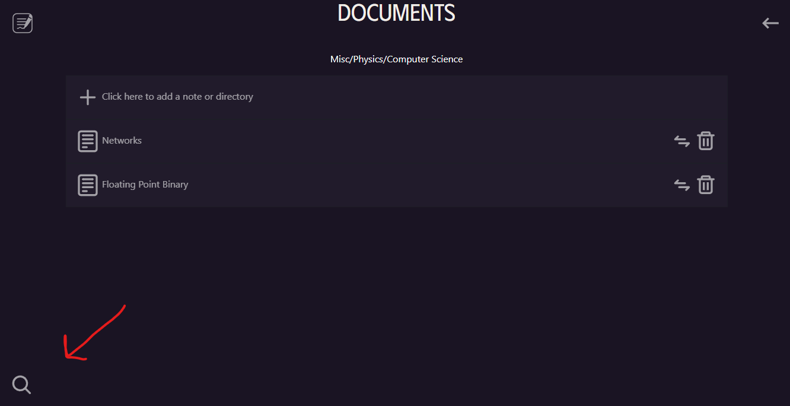
  Doing so brings up the following popup
  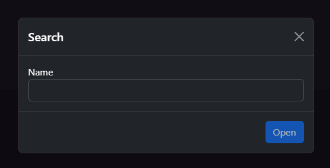
- Here you enter the name of the note you want to find
- If the file can be found, the open button will be enabled and pressing it will open that note in the canvas editor
- The name input is not case-sensitive

# Canvas editor

- Opening a note will open the canvas editor
  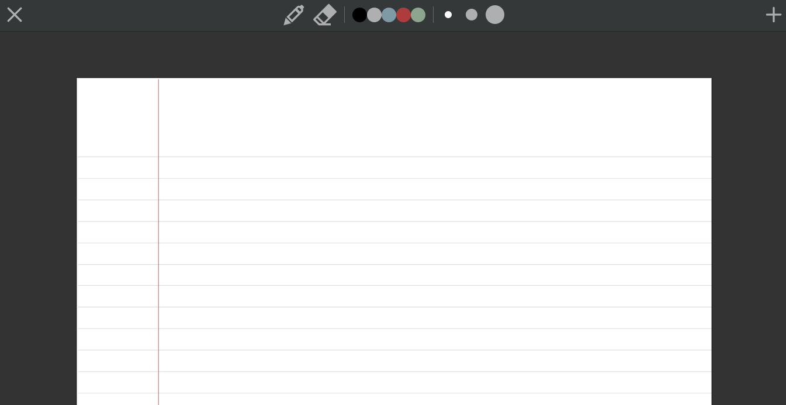

## Toolbar

- The cross button, found in the top left, closes the canvas editor and returns the user to the Document interface
- The pen button, second button from the right, enables the pen allowing the user to write on the canvas
- The eraser button, third from the right, enables the eraser allowing the user to erase anything that they have written on the canvas
- The colour buttons, allows the user to select the colour that the pen will write
- The thickness buttons, allows the user to select the thickness that the pen will write
- The "plus" button, found in the top right, adds a new page to the document
  - The page that is added has the same template as the last page in the document

## Controls

### Mouse and Keyboard

- Using the scroll wheel will scroll the document up and down
- Using the scroll wheel, with shift pressed down, will scroll the document left and right
- Using the scroll wheel, with control pressed down, will zoom the document in and out
- Pressing mouse button 1 down will draw or erase (depending on the tool selected)
  - If a drawing tablet is connected and the `Enable drawing tablet / drawing with touch` setting is enabled, it should also draw and erase

### Mobile

- You can scroll the document vertically and horizontally, using one finger
- Pinching in and out will zoom the document in and out
- Input from an Apple Pencil, will be detected as input for the pen and eraser allowing the user to draw and erase
  - Currently only the Apple Pencil is supported
